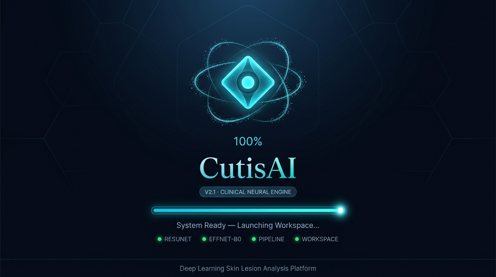
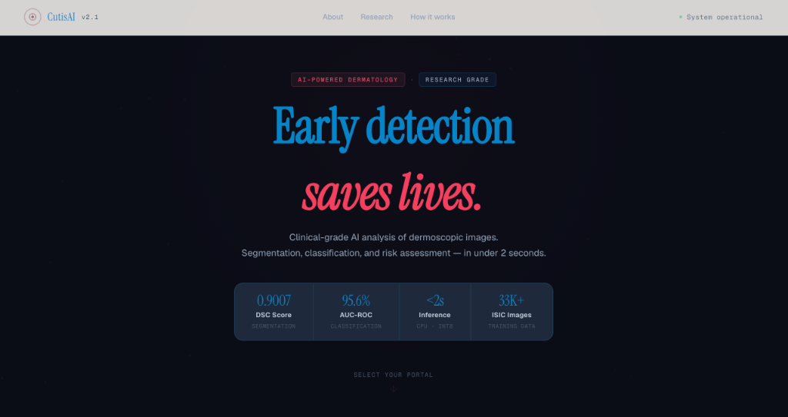
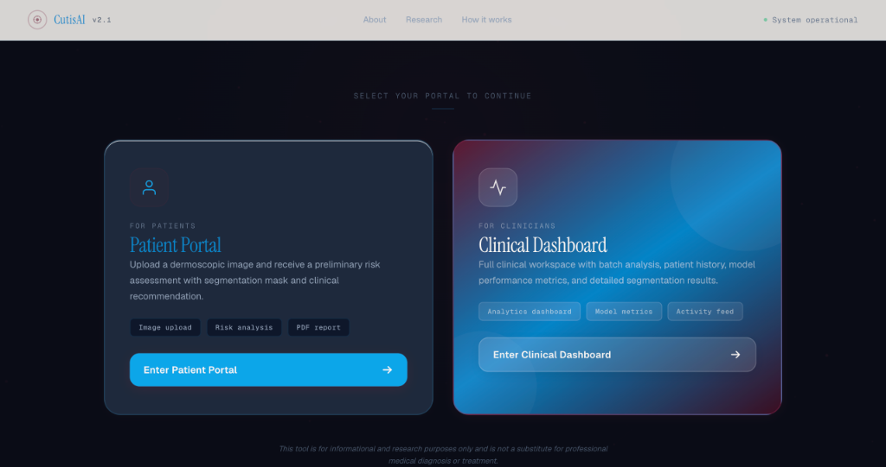
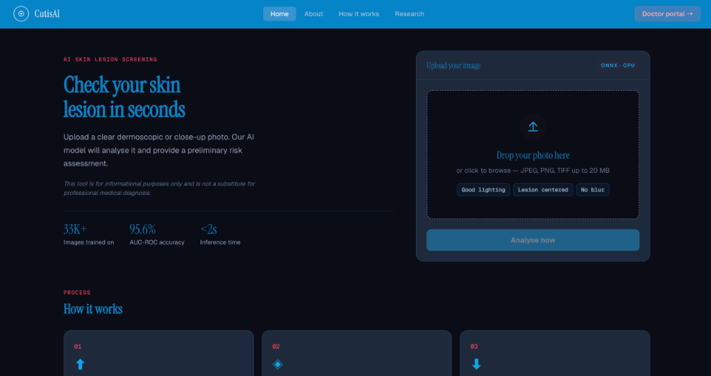
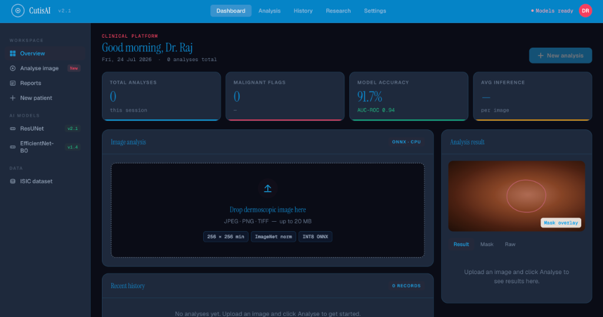
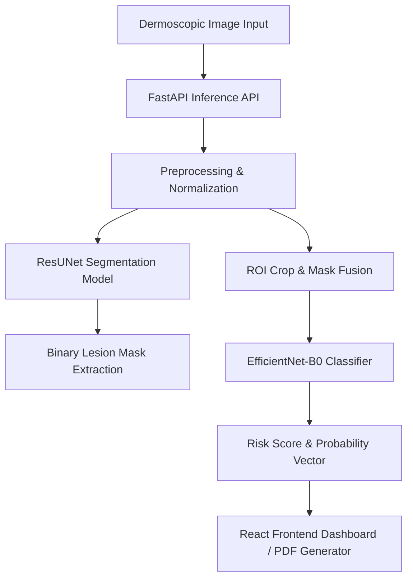

# CutisAI 🔬

### **Clinical-Grade Deep Learning Skin Lesion Detection & Classification System**

[](LICENSE)
[](https://www.python.org/)
[](https://reactjs.org/)
[](https://vitejs.dev/)
[](https://fastapi.tiangolo.com/)
[](https://pytorch.org/)
[](https://onnxruntime.ai/)

---

## 🌟 Application Screenshots

| 🚀 System Boot Loading | 🏠 Landing & Role Selection |
| :---: | :---: |
|  |  |

| 🩺 Patient Portal Upload | 📊 Patient Diagnostic Report |
| :---: | :---: |
|  |  |

| 🏥 Clinical Doctor Dashboard |
| :---: |
|  |

---

## 📋 Overview

**CutisAI** is a state-of-the-art deep learning system for automated skin lesion **segmentation**, **classification**, and **risk assessment** using dermoscopic imagery.

Trained on over **33,000+ ISIC images**, CutisAI provides real-time clinical triage assistance in under **2 seconds on standard CPU hardware** using INT8-quantized ONNX models.

### **Key Capabilities:**
- 🎯 **Lesion Boundary Segmentation**: High-precision pixel mask extraction using **ResUNet**.
- 🏷️ **Multi-Class & Malignancy Classification**: Rapid risk profiling powered by **EfficientNet-B0**.
- ⏱️ **Sub-2-Second CPU Inference**: Quantized INT8 ONNX execution for instant results.
- 📄 **Clinical PDF Report Generator**: Export structured diagnostic summaries with mask overlays and clinical recommendations.
- 👥 **Dual-Role Interface**: Dedicated portals tailored for both **Patients** and **Clinicians**.

---

## ✨ Features

- 🧠 **Two-Stage AI Pipeline**: Sequential segmentation and classification for robust ROI analysis.
- 🎨 **Modern Dark Aesthetic**: Custom Glassmorphism UI with responsive CSS design tokens.
- ⚡ **Optimized Inference**: INT8 ONNX Runtime backend eliminating heavy GPU dependencies.
- 📊 **Interactive Analytics**: Confidence score visualization and diagnostic breakdown.
- 🩺 **Clinical Recommendation Engine**: Automated risk category triage (Low, Moderate, High).
- 📱 **Fully Responsive**: Optimized for desktop monitors, clinical tablets, and mobile devices.

---

## 🏗️ Architecture



---

## 🛠️ Tech Stack

| Domain | Tech / Framework | Description |
| :--- | :--- | :--- |
| **Frontend** | React 18, Vite 5, TypeScript | SPA client with Vanilla CSS tokens & Glassmorphism |
| **Backend** | Python 3.10+, FastAPI | High-performance async REST API endpoint |
| **Machine Learning** | PyTorch, ONNX Runtime | ResUNet + EfficientNet-B0 (INT8 Quantized) |
| **PDF Engine** | HTML2Canvas / jsPDF | Dynamic clinical PDF report generation |
| **Dataset** | ISIC 2018 / 2019 / 2020 | 33,000+ annotated dermoscopic lesion images |

---

## 📊 Model Performance

| Metric | Result | Target Benchmark |
| :--- | :--- | :--- |
| **Dice Score (DSC)** | **0.9007** | Segmentation Accuracy |
| **AUC-ROC** | **95.6%** | Classification Discrimination |
| **Inference Latency** | **< 2.0 seconds** | CPU execution (INT8 ONNX) |
| **Dataset Size** | **33,000+** | ISIC Dermoscopic Images |

---

## 📁 Project Structure

```
CutisAI/
├── frontend/             # React SPA (Vite + TypeScript)
│   ├── src/
│   │   ├── components/   # Topbar, LoadingScreen, ResultPanel, Buttons
│   │   ├── pages/        # Landing, UserHome, UserResult, DoctorDashboard
│   │   ├── utils/        # generatePdf.ts
│   │   └── routing/      # AppRouter & lazy routes
├── backend/              # FastAPI Python service
│   ├── src/              # API routes & ONNX inference runner
│   └── models/           # ONNX INT8 model weights
├── training/             # PyTorch model training & evaluation scripts
├── docs/                 # PRD, TechStack, & Design System docs
├── images/               # Readme preview assets & screenshots
└── README.md
```

---

## 🚀 Quick Start

### **1. Clone the Repository**
```bash
git clone https://github.com/yashraj10messi/Cutis-AI.git
cd Cutis-AI
```

### **2. Frontend Setup**
```bash
cd frontend
npm install
npm run dev
```
> Frontend will start on `http://localhost:3000` (or `http://localhost:3001`).

### **3. Backend Setup**
```bash
cd backend
pip install -r requirements.txt
uvicorn src.main:app --reload --port 8000
```
> Backend API docs available at `http://localhost:8000/docs`.

---

## ⚠️ Medical Disclaimer

> [!IMPORTANT]
> CutisAI is a **research and educational prototype** and is **not** a certified medical device.
> Predictions generated by this system are strictly advisory and should never replace evaluation, diagnosis, or treatment by a licensed dermatologist or medical professional.

---

## 👤 Author & License

* **Author:** Yash Raj Sharan
* **Contact:** [yashraj10messi@gmail.com](mailto:yashraj10messi@gmail.com)
* **License:** [MIT License](LICENSE) — Copyright (c) 2026 Yash Raj Sharan

---

⭐ **If you find CutisAI helpful, consider giving it a star on GitHub!**
